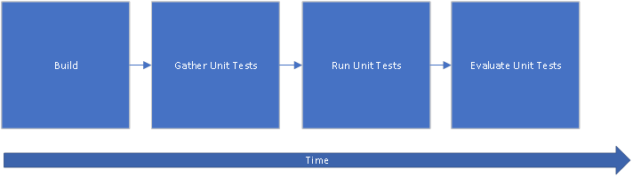
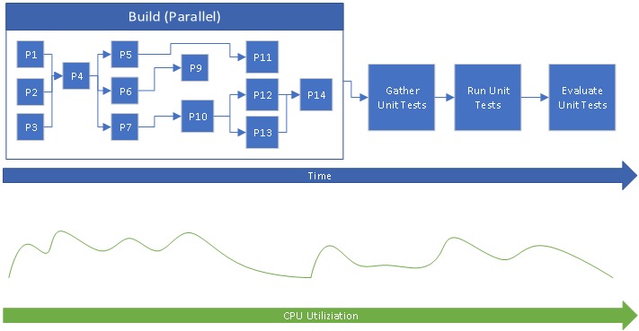
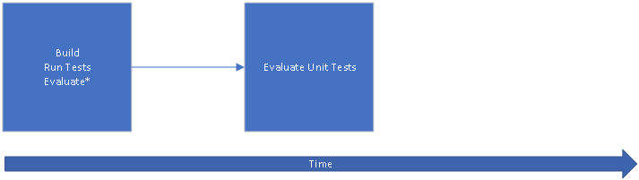
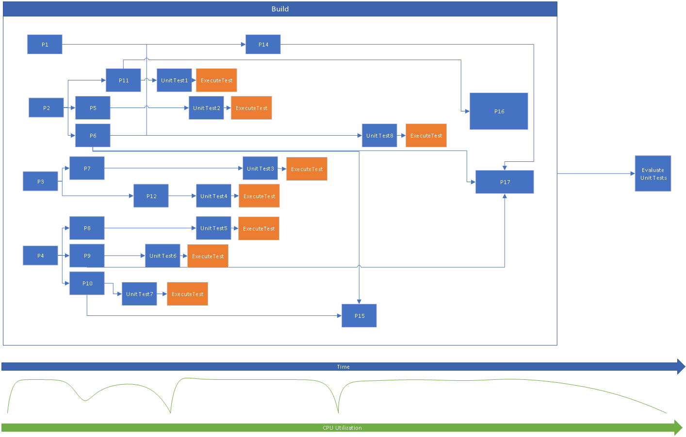

# NUnit.MSBuild
MSBuild Extension to execute NUnit3-Console after the Build Target

## Quick Start
Simply add `NUnit.MSBuild` as a NuGet Package Reference and then define the MSBuild Property `$(RunTests)=true`.

This can be done either explicitly in the project file (not recommended) or by modifying the command line arguments passed to MSBuild (recommended):

```
msbuild /restore /m Solution.sln /p:RunTests=true
```

Additional configuration options are available and described in the `Options` Section.

## Overview
A simple Continuous Integration Pipeline might look like this:



The advantages to this system is that it is very easy to understand when something occurs and we can easily track and debug where time is spent. All unit tests are guaranteed to be built prior to their execution and the `Gather Unit Tests` allows control outside the scope of the projects.

The downside is we do not achieve high CPU utilization in some scenarios, which means the amount of time it takes for a build to "complete" is extended. Furthermore in Cloud Based Scenarios where resources are paid for, usually by the minute, every second that you are not putting the system under 100% load you are burning cash.

In large .NET Applications a Build Master/DevOps Lead will normally build with `msbuild /m` to leverage MSBuild's [Parallel Build Capabilities](https://docs.microsoft.com/en-us/visualstudio/msbuild/building-multiple-projects-in-parallel-with-msbuild?view=vs-2019). A naive implementation will most likely look something like this:



While this will indeed increase CPU Utilization; you will still encounter valleys of low CPU utilization due to "dependency hedges" in which projects are dependent upon each other. On a large enough system, it is possible that the build could be doing more useful work while in this valley of low utilization.

One such example of useful work would be the execution of Unit Tests.

`NUnit.MSBuild` attempts to move the execution of unit tests to within the build process like so:



Which hopefully results in something like this:



The `Gather Unit Tests` step is gone from the above because we are now explicitly telling MSBuild which projects to run tests of. This has a cost associated with it in that the Test Project must reference this NuGet Package (an exercise left to the reader to ensure this always happens).

The `Evaluate*` step here as a slightly different meaning. Because the tests are run immediately after they have been built, we can tell much more quickly in the build process when a Unit Test has failed. Optionally, the build can be killed at this point, to give quicker feedback on an introduced failure (failfast). See Options below.

We still need an EvaluateUnitTests step, because we need to gather ALL of the run information for the entire build (not just individual unit tests) at the end of the run to generate a readable report.

### Assumptions
* It is assumed that there will be enough cores doing nothing that we do not create a "resource hedge".
    * In practice, because these tests would only be triggered by a build of a unit test project, generally this happens further down in the tree when cores are available.
    * In addition no project should "depend" on a Unit Test project which means that its unlikely to be blocking any project.
* It is assumed that even if this "resource hedge" is encountered; that the higher utilization of the cores over time will have a lower cost than waiting until everything is built then running the unit tests.
    * In practice, on a large code base (~3,200 Projects), usage has shown that, for this particular work load this is a good assumption.
* It is assumed that it is safe to run these tests in Parallel.
    * This is difficult to assess without knowing the code base in question.
    * Best practices dictate that Unit Tests do not rely on external resources/states (these would instead be Integration Tests) and thus should be generally safe to run in Parallel.
    * However many code bases have never been explicitly tested in such a difficult manner, no one is perfect, and chances are you goofed somewhere.
* It is assumed that all Tests will be explicitly declared so in the Projects themselves.
    * This is made easy due to the fact that these tasks are shipped as a NuGet Package, however maintaining a large number of projects is left as an exercise to the reader.
    * Any existing procedures for maintaining third party NuGet Packages can be leveraged.

### Nothing Is Free
* There is a recurring cost to ensure that your Unit Test Projects include the NuGet Package.
    * In Products with a high rate of new projects, this can cause Unit Tests to slip through CI unnoticed, unless strong controls are put around the introduction of new projects.
* This drastically increases complexity within the build system/CI.
    * You are at the mercy of `msbuild /m`'s scheduler. There are many improvements being made to this as of 2020.
    * Ensure that you have a firm grasp on the requirements of your Unit Tests, if you have broken any thread safety rules, you will encounter difficult to debug race conditions.
* Limited reprieve for hardware.
    * If you, or your hardware provider, have over-provisioned/over-promised resources, you may be in for a rude awakening due to increased utilization.
* Gathering of the final Unit Test Report may be more complicated.
    * This is heavily dependent upon the CI System you choose to use.

## Options
Currently there are several configurable options, most of which contain sane defaults that can be configured via setting a [MSBuild Properties](https://docs.microsoft.com/en-us/visualstudio/msbuild/msbuild-properties?view=vs-2019).

```xml
    <!--This is the package that does the heavy lifting to invoke the NUnit3-Console Application-->
    <PackageReference Include="NUnit.MSBuild">
      <Version>1.0.0</Version>
      <IncludeAssets>runtime; build; native; contentfiles; analyzers; buildtransitive</IncludeAssets>
      <PrivateAssets>all</PrivateAssets>
    </PackageReference>
  </ItemGroup>
  <!--This Property Group can Exist Anywhere In fact you may wish to only include in it certain Configurations (IE Debug or Release Only)-->
  <!--Alternatively you may wish to provide this on the command line-->
  <PropertyGroup>
    <!--This Property MUST be set to invoke the NUnit runner after the Build Target-->
    <RunTests>true</RunTests>

    <!--This normally is determined by looking at the $(PlatformTarget) to see if it is x86 but you can explicitly force it-->
    <NUnitUsex86Runner>true</NUnitUsex86Runner>

    <!--This is set by default but can be configured as below (default shown) assumes nunit3-console.exe exists in the given path-->
    <NUnitConsoleToolPath>C:\Program Files (x86)\NUnit.org\nunit-console\</NUnitConsoleToolPath>

    <!--Can be defined to any location; beware to make it unique if you have multiple projects. The default is shown below.-->
    <NUnitResultFileName>$([System.IO.Path]::Combine("$(OutputPath)","$(TargetName).TestResults.xml"))</NUnitResultFileName>

    <!--Determines if NUnit failures should be converted to warnings. This will stop the build if set to false on the first Unit Test Failure. Default is True.-->
    <NUnitContinueOnFailure>true</NUnitContinueOnFailure>
  </PropertyGroup>
```

## Technical Dive
This package is implemented as two portions:

1. `NUnit.MSBuild.targets`
    * This is a [MSBuild targets](https://docs.microsoft.com/en-us/visualstudio/msbuild/msbuild-targets?view=vs-2019) file that sets some reasonable defaults (which can all be overridden) and then extends the well known target `Build` by executing after it.
    * It compares the timestamp of the produced TestResults file (`$(NUnitResultFileName)`) to the produced Test Assembly (`$(TargetPath)`) to determine if it should run, thus properly supports incremental builds based on that assumption.
2. `NUnit.MSBuild.dll`
    * Is a [MSBuild Task Library](https://docs.microsoft.com/en-us/visualstudio/msbuild/task-writing?view=vs-2019) that contains a custom task to wrap `nunit3-console` using the standard [ToolTask](https://docs.microsoft.com/en-us/dotnet/api/microsoft.build.utilities.tooltask?view=msbuild-16) base class.

In general any Build Master/DevOps Lead with base MSBuild knowledge should be able to quickly recognize the standard patterns utilized therein.

## Contributing
Pull requests and bug reports are welcomed so long as they are MIT Licensed. Please use GitHub for all contact.

### Building
Until we have a CI in place simply check out the code and run `/Build/PackNuGetPackage.bat`

## License
This tool is MIT Licensed.
